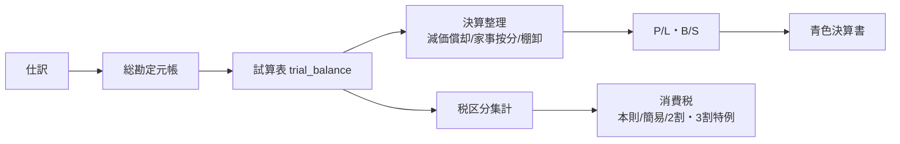
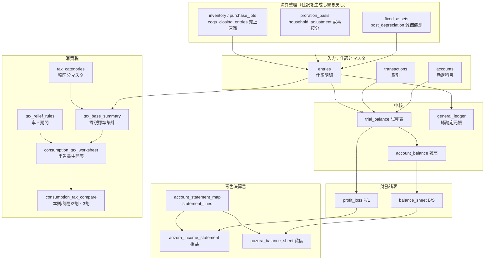

# 個人事業向け会計エンジン（PostgreSQL）

個人事業の青色申告を支える計算を、PostgreSQL の上に複式簿記と税務ロジックとして実装した、学習・検証用のプロジェクトです。所得税（青色決算書の主要行）と消費税（本則／簡易／2割・3割特例）までを、仕訳から一気通貫で計算します。

「会計ソフトを作る」こと自体より、**会計と税務を"長く壊れない"RDB設計にどう落とし込むか**に主眼があります。設計の背骨は2つです。

- **正しさは（アプリでなく）データベースの制約で守る**
- **制度変更はコードでなくデータで吸収する**

> ⚠️ 本リポジトリは学習・検証用です。税務上の助言を提供するものではありません。制度（税率・特例・期限など）は改正されます。実務では必ず最新の一次情報（国税庁等）をご確認ください。

---

## アーキテクチャ



中核は **試算表レイヤー**（`trial_balance`）です。P/L・B/S・青色決算書・消費税は、いずれもこの層を入力に組み立てます。様式や税率が変わっても、中間層が安定していればエンジン全体の寿命が延びる、という考え方です。

---

## データフロー

テーブル・ビュー・関数のレベルで、データがどう流れるかを示します。決算整理は新たな仕訳として `entries` に書き戻され、すべての集計は試算表（`trial_balance`）を経由します。



ポイントは2つです。**(1) 決算整理（減価償却・家事按分・棚卸）は計算結果を仕訳として `entries` に戻す**ため、試算表より下流の集計は一貫した数字を見ます。**(2) 消費税は科目残高ではなく `entries` × `tax_categories`（税区分）から課税標準を組む**ため、所得計算とは独立した経路で集計されます。

---

## モジュールとロード順

SQL は相互に依存するため、次の順で読み込んでください（`demo/run_demo.py` も同順です）。

| # | ファイル | 役割 |
|---|---|---|
| 1 | `sql/schema.sql` | 中核スキーマ。複式簿記（accounts/transactions/entries）、貸借一致制約、監査ログ、証憑保存、試算表・元帳ビュー |
| 2 | `sql/financial_statements.sql` | 試算表（期間指定）、P/L・B/S、貸借均衡の自己検算 |
| 3 | `sql/depreciation.sql` | 減価償却（定額・定率・一括）のスケジュール計算 |
| 4 | `sql/household_proration.sql` | 家事按分（事業割合の計算と決算整理） |
| 5 | `sql/inventory.sql` | 棚卸・売上原価（三分法） |
| 6 | `sql/aozora_statement.sql` | 青色決算書への写像（損益・貸借の主要行） |
| 7 | `sql/fixed_asset.sql` | 固定資産台帳（減価償却の自動仕訳化） |
| 8 | `sql/tax_categories.sql` | 税区分マスタ（消費税・インボイスの土台） |
| 9 | `sql/consumption_tax.sql` | 消費税エンジン（本則／簡易／2割・3割特例、経過措置） |

---

## 動かし方

PostgreSQL を別途立てなくても、`pgserver` でその場に起動して検証できます。

```bash
pip install pgserver --break-system-packages
python demo/run_demo.py
```

`demo/run_demo.py` は、架空のフリーランスエンジニアの1年分（売上・経費・固定資産・家事按分）を流し、**仕訳 → 試算表 → P/L・B/S → 青色決算書 → 固定資産台帳 → 消費税（中間表・3方式）** までをコンソールに出力します。P/L の利益が B/S の純資産に入って貸借が均衡するところまで、数字で追えます。

---

## 設計メモ

- **金額は整数（円）で保持**します。浮動小数点は 10 進小数を正確に表せず、税率の割戻しで 1 円のズレが生じ得るためです。税込→税抜の割戻しも整数演算で行います。
- **貸借一致は `DEFERRABLE INITIALLY DEFERRED` の制約トリガ**で、コミット時にまとめて検査します（確定済みの仕訳のみ対象）。
- **税区分は「税率」ではなく「申告書への集計ルール」**として設計しています（区分自身が売上/仕入・課税売上/課税仕入への集計可否を持つ）。売上か仕入かを科目タイプで判定しません。
- **税制の率・期間は `tax_relief_rules` テーブルにデータとして持ち**、計算ロジックには埋め込みません。改正は行の更新で吸収します。

---

## 既知の制限（正直な注記）

このエンジンは「計算の主要部分」までを対象にしており、次は未対応です。

- 消費税の本則課税は **課税売上割合95%以上・全額控除を前提**。個別対応方式／一括比例配分方式は未実装。
- 簡易課税は **単一のみなし仕入率を前提**（複数事業区分の加重平均は未対応）。
- 申告書様式レベルの処理（**国税7.8%/地方の分離、課税標準の千円未満・税額の百円未満切捨て**）は未実装で、合算税率で算定。
- **e-Tax への送信・取込形式の出力は対象外**。
- 監査ログ等は**電子帳簿保存法の考え方を参考にした設計**であり、「電帳法対応済み」ではありません。
- 固定資産の**除却・売却**、その他の決算整理（未払・前払・貸倒引当金など）は今後。

制度の率・期限は、実装時点で一次情報を確認していますが、改正されます。利用時は最新をご確認ください。

---

## ライセンス

MIT License。詳細はリポジトリ直下の `LICENSE` を参照してください（著作権者: se1987）。
